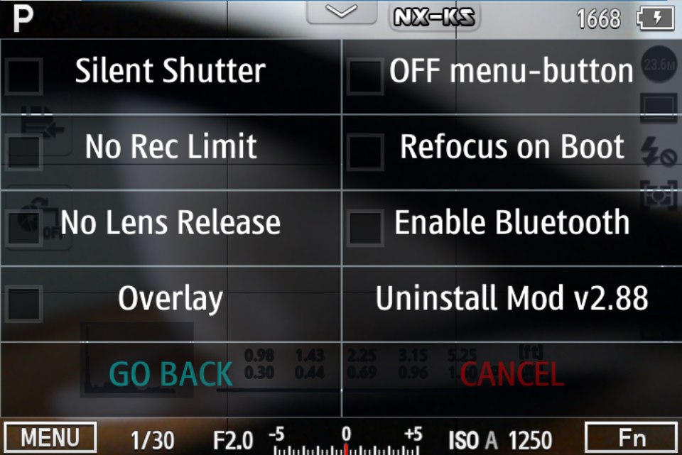

# NX-KS2 Fork

In 2016 and 2017, the user **KinoSeed** created a very useful firmware mod for
Samsung NX1 and NX500 cameras. It was uploaded to different sites over the
years, and none of the original download locations still exist.

This repository has two goals:

1. Recreate the history of the NX-KS mod changes based on
   [a mirror of the ZIPs](https://nxfiles.nx.tc/files/NX-KS-mod/).

2. Allow to modify and improve the mod, with the ultimate goal of releasing
   NX-KS3.x

## WARNING: DANGER ZONE

The history of this repository has been auto-generated. If people provide
additional ZIP files of versions that are missing, it might get re-generated
to complete the historical view.

That will make changes / forks harder to maintain. We hope to settle that
after a few weeks of the initial release, though.

## Original README

The original README is an OpenDocument file, but an auto-converted copy has
been integrated in [NX-KS_readme.md](NX-KS_readme.md).

## Integration and Functionality

The mod "hooks" into
[bluetoothd](https://github.com/ottokiksmaler/nx500_nx1_modding/blob/master/Running_scripts_without_factory_mode_BT.md)
and is started in the background if Bluetooth is turned on.

All script files are located in `/opt/usr/nx-ks/`.

The replacement `bluetoothd` will run `/opt/usr/nx-ks/init.sh` which initializes
the shell environment and starts
[keyscan](https://github.com/ottokiksmaler/nx500_nx1_modding/blob/master/Customizing%20keys.md).

`keyscan` will execute all `/opt/usr/nx-ks/auto/*.sh` script files, then
monitor the physical camera keys for `[EV]` + `[X]` key combinations and launch
the respective scripts from `/opt/usr/nx-ks/`.

As an example, pressing `[EV]` + `[RIGHT]` will run `EV_RIGHT.sh` and that
will toggle the touch functionality of the touch screen.

Pressing `[EV]`+`[OK]` on the NX1 or `[EV]`, `[EV]` on the NX500 will start
`loadgui.sh` which then will open
[`mod_gui`](https://github.com/ottokiksmaler/nx500_nx1_modding/tree/master/mod_gui)
and display the menu from the `gui_ini.*` file for the respective camera model.

The GUI supports sub-menu files (`@gui_settings.NX1`), starting commands, and
checkboxes by moving the respective command to `auto/`.

## License

Unfortunately, the original license of this code is not clear.

However, it is based on AGPL-licensed [nx500_nx1_modding](https://github.com/ottokiksmaler/nx500_nx1_modding)
and [nx-remote-controller-mod](https://mewlips.github.io/nx-remote-controller-mod).
